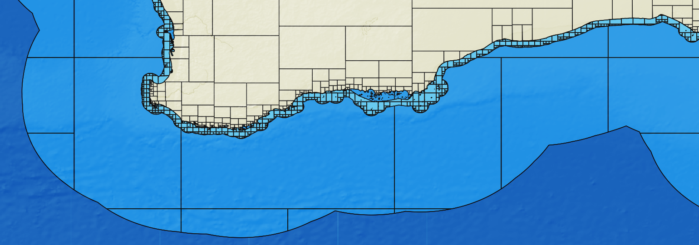

# Global Datasources

Global datasources published for use in SeaSketch geoprocessing projects

To re-generate this README file run `npx tsx scripts/datasourcesToDocs.ts`
## World Outline Polygon

World polygon for default project geography in seasketch geoprocessing proejcts

- Datasource ID: world
- Version: 1.0
- Publisher: SeaSketch
- Publish Date: 20231018
- Source: 
- URL: [https://gp-global-datasources-datasets.s3.us-west-1.amazonaws.com/world.fgb](https://gp-global-datasources-datasets.s3.us-west-1.amazonaws.com/world.fgb)
- Feature ID property: 
- Feature name property: N/A

## World EEZ Polygons v12

World EEZ boundary and disputed area polygons v12. Outer 200 nautical mile boundary created based on ESRI World Countries 2014 which seems to have been augmented further using bathymetry data to include additional land masses.  Consult with partners on what the authoritative boundary should be

- Datasource ID: global-eez-mr-v12
- Version: 12.0
- Publisher: Flanders Marine Institute (VLIZ)
- Publish Date: 20231025
- Source: [https://marineregions.org/](https://marineregions.org/)
- URL: [https://gp-global-datasources-datasets.s3.us-west-1.amazonaws.com/global-eez-mr-v12.fgb](https://gp-global-datasources-datasets.s3.us-west-1.amazonaws.com/global-eez-mr-v12.fgb)
- Feature ID property: GEONAME
- Feature name property: GEONAME

## World EEZ With Country Boundaries v4

The union of EEZ's with world country boundaries. Outer 200 nautical mile boundary created based on ESRI World Countries 2014 which seems to have been augmented further using bathymetry data to include additional land masses.  Consult with partners on what the authoritative boundary should be

- Datasource ID: global-eez-land-union-mr-v4
- Version: 4.0
- Publisher: Flanders Marine Institute (VLIZ)
- Publish Date: 20241010
- Source: [https://marineregions.org/](https://marineregions.org/)
- URL: [https://gp-global-datasources-datasets.s3.us-west-1.amazonaws.com/global-eez-land-union-mr-v4.fgb](https://gp-global-datasources-datasets.s3.us-west-1.amazonaws.com/global-eez-land-union-mr-v4.fgb)
- Feature ID property: UNION
- Feature name property: UNION

## World 12 Nautical Miles Zone (Territorial Seas) v4

Created based on ESRI World Countries 2014 which seems to have been augmented further using bathymetry data to include additional land masses.  Consult with partners on what the authoritative boundary should be

- Datasource ID: global-eez-12nm-mr-v4
- Version: 4.0
- Publisher: Flanders Marine Institute (VLIZ)
- Publish Date: 20231018
- Source: [https://marineregions.org/](https://marineregions.org/)
- URL: [https://gp-global-datasources-datasets.s3.us-west-1.amazonaws.com/global-eez-12nm-mr-v4.fgb](https://gp-global-datasources-datasets.s3.us-west-1.amazonaws.com/global-eez-12nm-mr-v4.fgb)
- Feature ID property: GEONAME
- Feature name property: GEONAME

## Daylight Map Coastline Polygons v1.58

Daylight map distribution v1.58 coastline land polygons.  This is does not represent official baseline, consult with partners on official boundary

- Datasource ID: global-coastline-daylight-v158
- Version: 1.58
- Publisher: Meta
- Publish Date: 20241112
- Source: [https://daylightmap.org/](https://daylightmap.org/)
- URL: [https://gp-global-datasources-datasets.s3.us-west-1.amazonaws.com/global-coastline-daylight-v158.fgb](https://gp-global-datasources-datasets.s3.us-west-1.amazonaws.com/global-coastline-daylight-v158.fgb)
- Feature ID property: FID
- Feature name property: N/A

## BioOracle Present Day Surface pH

BioOracle Present Day Surface pH global raster

- Datasource ID: bo-present-surface-ph
- Version: 2.2
- Publisher: BioOracle
- Publish Date: 2021-09-24
- Source: [https://www.bio-oracle.org/](https://www.bio-oracle.org/)
- URL: [https://gp-global-datasources-datasets.s3.us-west-1.amazonaws.com/bo-present-surface-ph.tif](https://gp-global-datasources-datasets.s3.us-west-1.amazonaws.com/bo-present-surface-ph.tif)

## BioOracle Present Day Surface Temperature Maximum

BioOracle Present Day Surface Temperature Maximum global raster

- Datasource ID: bo-present-surface-temp-max
- Version: 2.2
- Publisher: BioOracle
- Publish Date: 2021-09-24
- Source: [https://www.bio-oracle.org/](https://www.bio-oracle.org/)
- URL: [https://gp-global-datasources-datasets.s3.us-west-1.amazonaws.com/bo-present-surface-temp-max.tif](https://gp-global-datasources-datasets.s3.us-west-1.amazonaws.com/bo-present-surface-temp-max.tif)

## BioOracle Present Day Surface Temperature Minimum

BioOracle Present Day Surface Temperature Minimum global raster

- Datasource ID: bo-present-surface-temp-min
- Version: 2.2
- Publisher: BioOracle
- Publish Date: 2021-09-24
- Source: [https://www.bio-oracle.org/](https://www.bio-oracle.org/)
- URL: [https://gp-global-datasources-datasets.s3.us-west-1.amazonaws.com/bo-present-surface-temp-min.tif](https://gp-global-datasources-datasets.s3.us-west-1.amazonaws.com/bo-present-surface-temp-min.tif)

## Marine Ecoregions of the World

A biogeographic classification of the world's coastal and continental shelf waters following a nested hierarchy of realms, provinces and ecoregions

- Datasource ID: meow-ecos
- Version: 20190911
- Publisher: The Nature Conservancy
- Publish Date: 20190911
- Source: [https://tnc.maps.arcgis.com/home/item.html?id=ed2be4cf8b7a451f84fd093c2e7660e3](https://tnc.maps.arcgis.com/home/item.html?id=ed2be4cf8b7a451f84fd093c2e7660e3)
- URL: [https://gp-global-datasources-datasets.s3.us-west-1.amazonaws.com/meow-ecos.fgb](https://gp-global-datasources-datasets.s3.us-west-1.amazonaws.com/meow-ecos.fgb)
- Feature ID property: ECOREGION
- Feature name property: ECOREGION
