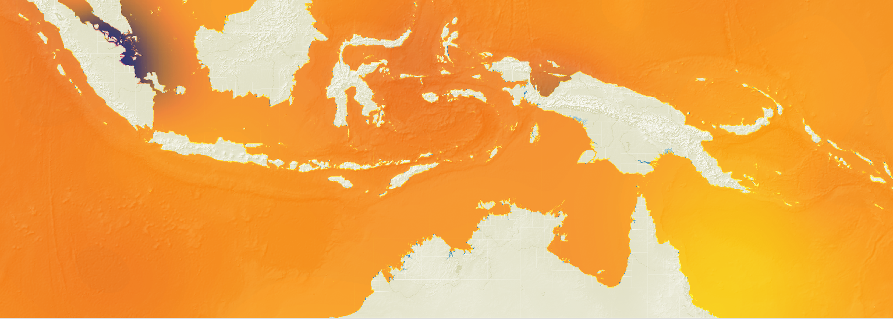

# Global Datasources

A set of global datasources published for use in SeaSketch [geoprocessing](https://seasketch.github.io/geoprocessing/) projects.

[See full datasource list](./DATASOURCES.md)

Vector datasources are subdivided into smaller pieces and published in flatgeobuf format for efficient fetching of subsets of the data.

Raster datasources are published as cloud-optimized GeoTIFF files format for efficient fetching of subsets of the data.

## View and Export Datasources

If you don't want to download an entire datasource to explore it, or if you want to export a subset of it for import into your project, the easiest way is to load them in QGIS using the URL.

### Vector Datasources

* Zoom in to your area of interest on the map. Doing this first will avoid downloading the whole dataset because your map extent is set to the whole world.
* Add layer: Layer -> Add Layer -> Add Vector Layer -> Choose Protocol https -> Copy URL of FGB to URI field -> Add.

To export a subset of polygons:
* `Select Features By Area` and then click or draw a bounding box or `Select Features By Value` and find an attribute such as country name that will select exactly what you want.
* Right-click the layer that you have features selected for in the Layer menu and then click Export -> Save selected features as -> Flatgeobuf -> enter filename and save.

You can now import this smaller flatgeobuf file into a geoprocessing project.

## Raster Datasources

* Zoom in to your area of interest on the map. Doing this first will avoid downloading the whole dataset because your map extent is set to the whole world.
* Add layer: Layer -> Add Layer -> Add Raster Layer -> Choose Protocol https -> Copy URL of TIF to URI field -> Add.

To export a subset of polygons:
* Raster menu -> Extraction -> Clip raster by extent -> Clipping extent menu click the dropdown -> Draw on map canvas -> draw the bounding box -> Leave as EPSG:6933 -> Click Run -> Close menu once complete
* Right-click the new raster clip layer -> Export -> Save As -> GeoTiff.

You can now import this smaller GeoTiff file into a geoprocessing project.